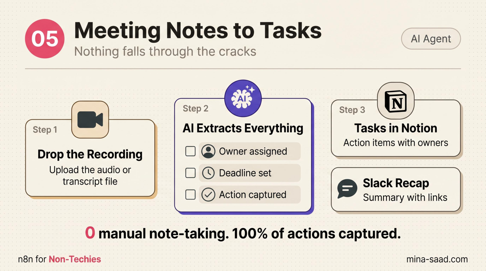

# n8n Meeting Notes to Tasks

    

> Drop a meeting transcript in. Get a structured Notion summary, individual tasks for every action item with owners and due dates, and a Slack recap, in one webhook call.

> Part of the **[n8n-ai-agents catalog](https://github.com/MinaSaad1/n8n-ai-agents)** , see the catalog for shared [architecture principles](https://github.com/MinaSaad1/n8n-ai-agents/blob/main/docs/architecture-principles.md), [security framework](https://github.com/MinaSaad1/n8n-ai-agents/blob/main/docs/security-framework.md), and [output conventions](https://github.com/MinaSaad1/n8n-ai-agents/blob/main/docs/output-conventions.md) every template in the collection follows.



---

## What it does

- Accepts a meeting transcript via POST webhook (works with Otter.ai, Fireflies, Zoom, or pasted manual notes)
- Sends the transcript to Claude Sonnet 4.6 with an extraction prompt that returns structured JSON
- Pulls out: summary, key decisions, action items (task + owner + due date + priority), and attendees
- Creates one Notion page per meeting in your meeting-notes database
- Creates one Notion task per action item in your tasks database, with owner and priority filled
- Posts a Slack recap to a channel of your choice with the summary and action item list
- Responds to the original webhook with `{ received: true, tasks_created: N }` so the upstream caller can confirm

## Architecture

```
POST /webhook/meeting-notes  { transcript, meeting_title, date }
        │
        ▼
Extract Meeting Fields  ─── Set node, normalizes inputs and defaults date
        │
        ▼
Claude Extraction Model + Extract Actions and Decisions  ─── chainLlm + Anthropic
        │
        ▼
Parse Meeting Data  ─── Code node, strips markdown fencing, parses JSON safely
        │
        ├──▶ Notion Meeting Summary Page  ─── one page per meeting
        ├──▶ Split Action Items  ─── fan out to one item per action
        │              │
        │              ▼
        │       Notion Create Task  ─── one Notion row per action item
        │
        └──▶ Slack Meeting Recap  ─── posts summary + tasks to your channel
                       │
                       ▼
              Webhook Response  ─── { received, tasks_created }
```

Eleven nodes including a sticky README. The Code node is the safety net: if Claude returns unparseable text, the workflow still completes with a degraded payload instead of crashing the whole run.

See [`docs/ARCHITECTURE.md`](docs/ARCHITECTURE.md) for the full component breakdown.

## Requirements

- **n8n** >= 1.78 (cloud or self-hosted)
- **Anthropic API key** (Claude Sonnet 4.6 model access)
- **Notion** workspace with two databases: one for meeting notes, one for tasks
- **Slack** workspace and a channel to post recaps to
- **A way to POST to your webhook**: a meeting tool's webhook output, a Make/Zapier step, or a curl from your laptop

## Quickstart

### 1. Clone

```bash
git clone https://github.com/MinaSaad1/n8n-meeting-notes-to-tasks.git
cd n8n-meeting-notes-to-tasks
```

### 2. Prepare your Notion databases

You need two Notion databases. Set them up before you import the workflow.

**Meeting Notes database** (one row per meeting). Properties:

| Property | Type |
|---|---|
| Name (title) | title |
| Date | date |
| Summary | rich text |
| Attendees | rich text |

**Tasks database** (one row per action item). Properties:

| Property | Type |
|---|---|
| Name (title) | title |
| Owner | rich text |
| Priority | select (`high`, `medium`, `low`) |
| Due Date | date |
| Source | rich text |

Grab both database IDs from the Notion URL (the 32-character chunk before `?v=`).

### 3. Import the workflow into n8n

1. n8n -> **Workflows** -> **Import from File**
2. Select [`workflows/01-meeting-notes-to-tasks.json`](workflows/01-meeting-notes-to-tasks.json)
3. Open the imported workflow

### 4. Create credentials

| Node | Credential | Notes |
|---|---|---|
| `Claude Extraction Model` | Anthropic API | Set the API key. Default model is `claude-sonnet-4-5`, swap to `claude-sonnet-4-6` once your account has access. |
| `Notion Meeting Summary Page` | Notion OAuth2 (or internal integration token) | The integration must be invited to both databases. |
| `Notion Create Task` | Same Notion credential as above | Reuse the credential, just point it at the tasks database. |
| `Slack Meeting Recap` | Slack OAuth2 | Bot needs `chat:write`. Invite the bot to the target channel. |

### 5. Wire your IDs into the nodes

Open these three nodes and replace the placeholders:

- **Notion Meeting Summary Page** -> `databaseId`: replace `YOUR_NOTION_MEETING_NOTES_DB_ID`
- **Notion Create Task** -> `databaseId`: replace `YOUR_NOTION_TASKS_DB_ID`
- **Slack Meeting Recap** -> `channel`: replace `YOUR_SLACK_CHANNEL_ID` (the channel ID, not the name; right-click the channel in Slack -> View channel details -> bottom of the modal)

### 6. Activate and grab the webhook URL

Activate the workflow. Open the **Meeting Transcript Webhook** node and copy the production URL. The path is `/webhook/meeting-notes`.

### 7. Test with a real transcript

```bash
curl -X POST https://YOUR-N8N-HOST/webhook/meeting-notes \
  -H "Content-Type: application/json" \
  -d '{
    "meeting_title": "Sales sync, Tuesday",
    "date": "2026-05-04",
    "transcript": "Mina: we should send the proposal to Acme by Friday. Sara: I will own that. We agreed to drop the discount tier..."
  }'
```

You should get `{ "received": true, "tasks_created": 1 }` back, see one new page in your meeting-notes database, one row in your tasks database, and a recap message in Slack.

## Configuration

- **Different LLM**: swap the `Claude Extraction Model` node for OpenAI or Google Gemini chat model nodes. The chainLlm node downstream is provider-agnostic.
- **Tighter extraction**: edit the prompt inside `Extract Actions and Decisions`. Add team member names so Claude maps "John" to the right Owner. Add a default due-date rule like "if no date is mentioned, use today + 2 business days".
- **Asana or Trello instead of Notion**: replace `Notion Create Task` with the Asana or Trello node. The upstream Code node already gives you `task`, `owner`, `due_date`, `priority` per item.
- **Email follow-up draft**: add a Gmail `Create Draft` node downstream of `Parse Meeting Data`. Pass `summary` as the body and a templated subject like `Recap: {{ meeting_title }}`. The draft sits in Gmail for review before sending.
- **Skip Slack**: disable the `Slack Meeting Recap` node and remove its connection. The rest of the workflow runs unchanged.

## Troubleshooting

| Symptom | Cause | Fix |
|---|---|---|
| Webhook returns `tasks_created: 0` but transcript was real | Claude returned text that wasn't valid JSON | Check the `Parse Meeting Data` execution. The Code node falls back to an empty `action_items` array on parse failure. Tighten the prompt or lower model temperature. |
| Notion node errors with "object_not_found" | Integration not invited to the database | In Notion, open the database, click the `...` menu, Connections, add your integration. Do this for both databases. |
| Tasks created with empty Owner | Transcript didn't name a responsible party | The prompt defaults to `Unassigned`. If yours doesn't, re-read the prompt text in `Extract Actions and Decisions` and confirm the rule is intact. |
| Slack post silently drops | Bot not in the channel | Re-invite the bot, confirm `chat:write` scope, and use the channel ID (starts with `C`), not the channel name. |
| Date shows up as today for every meeting | `date` field missing from the POST body | The Set node defaults `meeting_date` to `$now`. Pass an ISO date in the request body to override. |
| Webhook returns 500 | An n8n credential is misconfigured | Open the failed execution, scroll to the red node, check the credential dropdown is set. |

## Security

Five things matter for this workflow:

1. **Webhook authentication**, the path is public by default. Add a header check or query token.
2. **Transcript PII**, recordings often contain confidential info. Audit before sending to a hosted LLM.
3. **Notion scope**, the integration only needs access to the two databases the workflow writes to.
4. **Prompt injection through transcript content**, a malicious transcript can attempt to redirect Claude's output. The Code-node JSON parse limits blast radius.
5. **Slack channel privacy**, the recap repeats the summary publicly to whoever is in that channel.

Full threat model and layered defenses in [`docs/SECURITY.md`](docs/SECURITY.md).

## Roadmap

- [ ] Optional Gmail draft node for the follow-up email
- [ ] Header-based webhook auth as a default, not an add-on
- [ ] Calendar lookup to auto-populate `attendees` from the meeting invite
- [ ] Per-owner DM in Slack so each owner sees their tasks privately

## License

MIT, see [LICENSE](LICENSE).

## Credits

Built by [Mina Saad](https://github.com/MinaSaad1). Part of the [n8n-ai-agents catalog](https://github.com/MinaSaad1/n8n-ai-agents).
